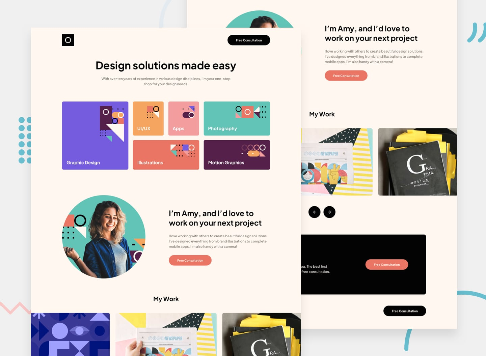

# Frontend Mentor - Single-page design portfolio solution

This is a solution to the [Single-page design portfolio challenge on Frontend Mentor](https://www.frontendmentor.io/challenges/singlepage-design-portfolio-2MMhyhfKVo). Frontend Mentor challenges help you improve your coding skills by building realistic projects. 

## Table of contents

- [Overview](#overview)
  - [The challenge](#the-challenge)
  - [Screenshot](#screenshot)
  - [Links](#links)
- [My process](#my-process)
  - [Built with](#built-with)
  - [Continued development](#continued-development)
- [Author](#author)
- [Acknowledgments](#acknowledgments)

## Overview

### The challenge

Users should be able to:

- View the optimal layout for the site depending on their device's screen size
- See hover states for all interactive elements on the page
- Navigate the slider using either their mouse/trackpad or keyboard

### Screenshot

### Links

- Solution URL: [GitHub](https://github.com/NgocMinhThuNguyen/SINGLE-PAGE-DESGIN-PORTFOLIO)
- Live Site URL: [Live Site](https://your-live-site-url.com)

## My process

### Built with

- Semantic HTML5 markup
- CSS custom properties
- Flexbox
- CSS Grid
- Mobile-first workflow
- Javascript

### Continued development

I'm learning about animation. I'll come back to make some animations like smooth change between images when user click on next/back button

## Author

- Website - [Thu Nguyen](https://github.com/NgocMinhThuNguyen)
- Frontend Mentor - [@NgocMinhThuNguyen](https://www.frontendmentor.io/profile/NgocMinhThuNguyen)

## Feedback

Hello beautiful!

Thank you for visiting my solution. I really appreciate if you could spend some time on my solution and give me some feedback to improve my solution!

Have a nice day!

Thank you!
